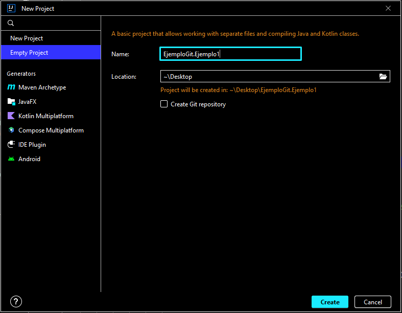
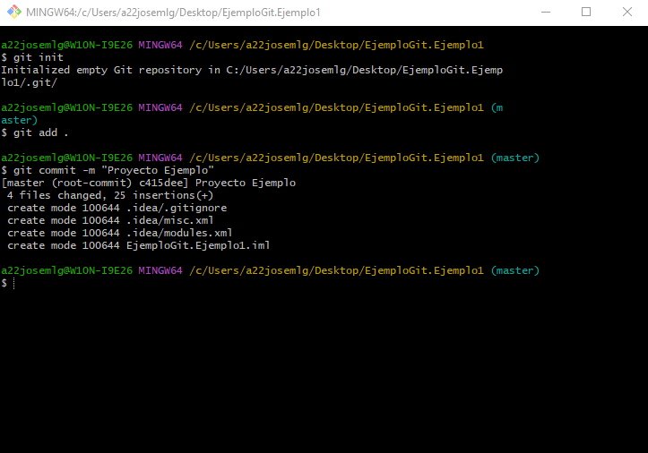

# Trabajo/Tutorial de GitHub

## Indice

 1. ¿**Que es** Git y Github?
    1. **Git**
    2. **GitHub**
    
2.  **Comandos Básicos** Git
    1. **Add**

    2. **Commit**

    3. **Push**

    4. **Pull**

    5. **Clone**

    6. **CheckOut**

    7. **Branch**

    8. **Merge**

       - **Conflictos en el Merge**

 3. **Ejercicios de Ejemplo Resueltos**
    1. **Ejercicio 1**
    2. **Ejercicio 2**
    3. **Ejercicio 3**
    4. **Ejercicio 4**

¿Que es Git y GitHub? 
===

Comandos Básicos de Git
===
 - Add
 
    aaaa
 
 - Commit
 
    aaaaa
 
 - Push
 
    aaaaa
 
 - Pull
 
    aaaa
 
 - Clone
 
    aaaaa

 - CheckOut
 
    aaaaaaa

 - Branch
 
   aaaaaa

 - Merge
 
   aaaaaa

 - Conflictos de Merge
    
   aaaaa
   
Ejercicios de Ejemplo Resueltos
===

Ejercicio 1
---
El primer ejercicio consta de los siguientes pasos.
	1- Crear un proyecto en IntelliJ
	2- Subir el proyecto a un repositorio **local**

**1ª parte del ejercicio.**
Para crear un proyecto hará falta abrir intelliJ y clickar en: File > New > Project…
Una vez dentro nos saldra un menú como este...

Una vez dentro le ponemos nombre al proyecto la localización donde queramos guardarlo y se le clicka en “Create” una vez hayamos finalizado.

**2ª parte del ejercicio.**
Abriremos **Git Bash** en la ubicación del proyecto.
Usaremos los comandos del terminal para crear un repositorio **local** al cual subiremos  el proyecto que acabamos de crear de la siguiente manera.

Primero se hace un “ **git init** ” para hacer el repositorio local al que subiremos el proyecto
Segundo se hace un “ **git add** . ” para añadir todo el contenido de la carpeta a la subida
Tercero se hace un “ **git commit -m “Proyecto Ejemplo”** ” para subir todo lo almacenado a la subida al repositorio local.

Ejercicio 2
---

Ejercicio 3
---

Ejercicio 4
---

